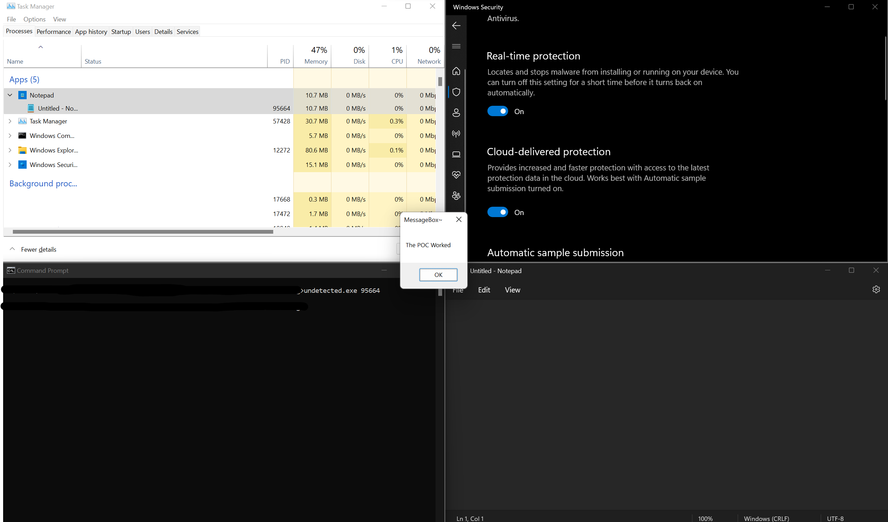

# SysWhispers2 Proof-Of-Concept
A POC demonstrating how [SysWhispers2](https://github.com/jthuraisamy/SysWhispers2) can be used to bypass AV and EDR tools.

## How It Works?
Both binaries are non-malicious and attempt to inject an alert box into a process (specified by <PID>). `undetected.exe` utilises [SysWhispers2](https://github.com/jthuraisamy/SysWhispers2) to make direct system calls instead of using the Windows API. EDR and AV solutions usually hook the API at the user level to attempt to block malicious activity. By avoiding the Windows API these hooks can't intercept the calls.
You can read more [here](https://outflank.nl/blog/2019/06/19/red-team-tactics-combining-direct-system-calls-and-srdi-to-bypass-av-edr/).
  
## detected.exe
This binary is used to demonstrate process injection without the usage of [SysWhispers2](https://github.com/jthuraisamy/SysWhispers2). Running this binary will cause Windows Defender to flag and delete the executable.
`Usage: detected.exe <PID>`
  
## undetected.exe
This executable utilises [SysWhispers2](https://github.com/jthuraisamy/SysWhispers2) to make direct system calls injecting shellcode into a specified process. This executable will hopefully do so without being detected by AV/EDR.

  
## Notes
Within the undetected.exe binary I had to XOR encrypt the shellcode payload. This was due to static analysis flagging the shell code as malicious.
The command used to generate the final shellcode was:
`.\msfvenom.bat -p windows/x64/messagebox TEXT="The POC Worked!" --encrypt xor --encrypt-key ~ -f csharp`
